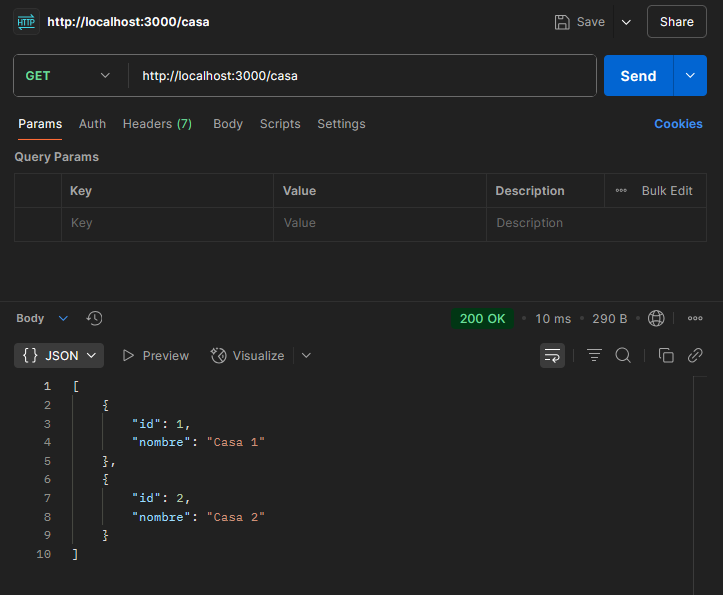
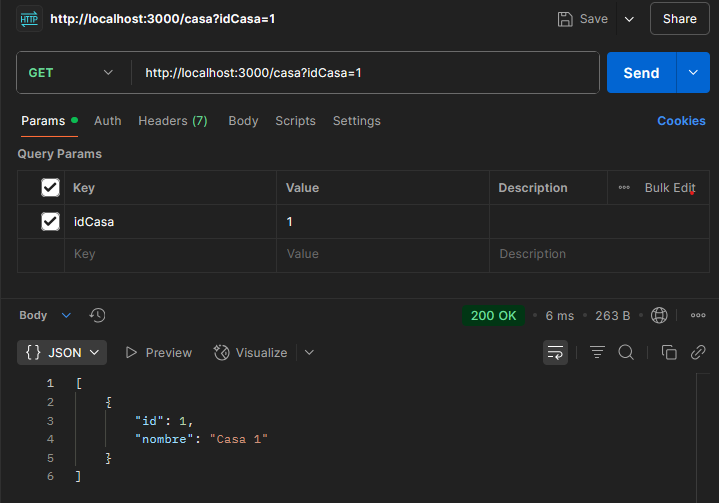
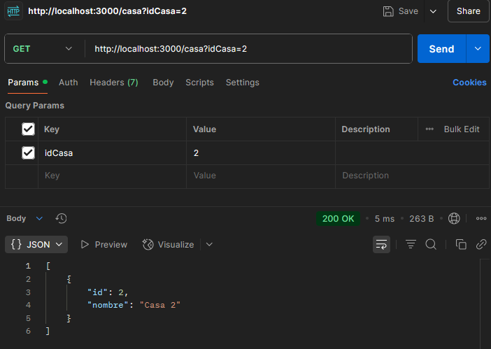
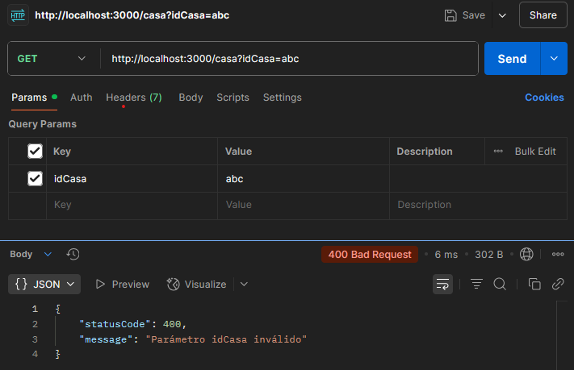
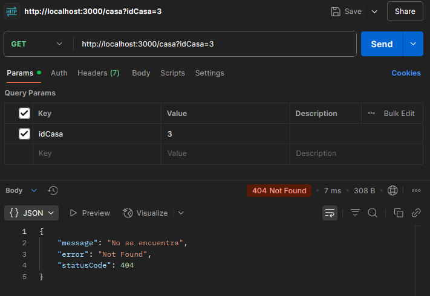

# Examen Servicio REST - Consulta de Casas

**Estudiante:** Santos Villarreal  
**Framework:** NestJS con TypeScript

Este proyecto implementa un servicio REST para consultar información de casas. Está desarrollado con **NestJS** y ofrece una interfaz `GET /casa` para obtener una lista completa de casas o una casa específica por su ID. Todo el comportamiento se gestiona dentro del archivo `app.controller.ts`.

---

## Ejecución del Proyecto

1. Ir al directorio raíz del servidor:

   ```bash
   cd 02-servidor/ejemplo-servidor
   ```

2. Instalar dependencias:

   ```bash
   npm install
   ```

3. Ejecutar el servidor:

   ```bash
   npm run start
   ```

> El servidor se ejecutará por defecto en: [http://localhost:3000](http://localhost:3000)

---

## Código Base

Toda la lógica se encuentra directamente en `02-servidor\ejemplo-servidor\src\app.controller.ts`:

```ts
@Get('/casa')
@HttpCode(200)
getCasa(@Query('idCasa') idCasa?: string) {
  if (!idCasa) {
    return this.casas;
  }

  const id = parseInt(idCasa, 10);
  if (isNaN(id) || id <= 0) {
    throw new HttpException('Parámetro idCasa inválido', 400);
  }

  const casa = this.casas.find(c => c.id === id);
  if (!casa) {
    throw new NotFoundException('No se encuentra');
  }

  return [casa];
}
```

---

## Endpoint Disponible

### `GET /casa`

Este endpoint permite consultar las casas disponibles. El comportamiento depende del uso (o no) del parámetro `idCasa`.

---

### 1. Sin Parámetro `idCasa`

Consulta todas las casas:

```http
GET http://localhost:3000/casa
```

**Respuesta esperada:**
```json
[
  { "id": 1, "nombre": "Casa 1" },
  { "id": 2, "nombre": "Casa 2" }
]
```
**Respuesta obtenida:**



---

### 2. Con Parámetro Válido `idCasa`

Consulta una casa por su ID:

```http
GET http://localhost:3000/casa?idCasa=1
```

**Respuesta esperada:**
```json
[
  { "id": 1, "nombre": "Casa 1" }
]
```
**Respuestas obtenidas:**






---

### 3. Con Parámetro Inválido

```http
GET http://localhost:3000/casa?idCasa=abc
```

**Respuesta esperada:**
```json
{
  "statusCode": 400,
  "message": "Parámetro idCasa inválido"
}
```
**Respuesta obtenida:**



---

### 4. Con ID No Existente

```http
GET http://localhost:3000/casa?idCasa=3
```

**Respuesta esperada:**
```json
{
  "statusCode": 404,
  "message": "No se encuentra",
  "error": "Not Found"
}
```
**Respuesta obtenida:**


---

